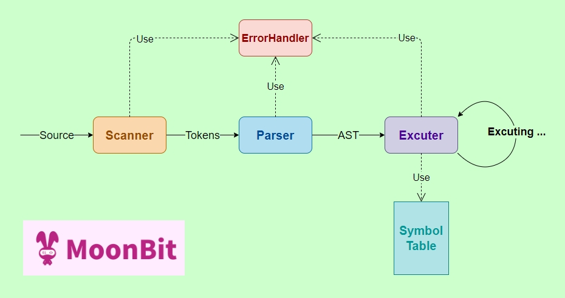

# 🌙🐇 MBCI ⚙️ > Moonbit mini C Interpreter 

### MBCI is a toy interpreter to excute some easy C programs

## Support
Global and local variable. Multiple scopes.

Variable data type: int. Function return type: int, void.

Common expressions.

If statement. While statement.

Printf.

***The full syntax is in MiniC.ebnf***

## Framework



## Build
Ensure you have installed moonbit toolkit
```shell
moon build
```

## Run
Because wasm is not convenient to manipulate files, so I hardcode some C programs to moonbit String under test/. You can change the code commented in the main function to test. : )

```shell
moon run main
```
